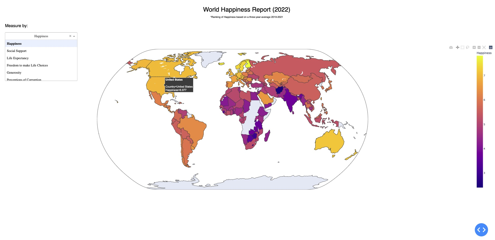
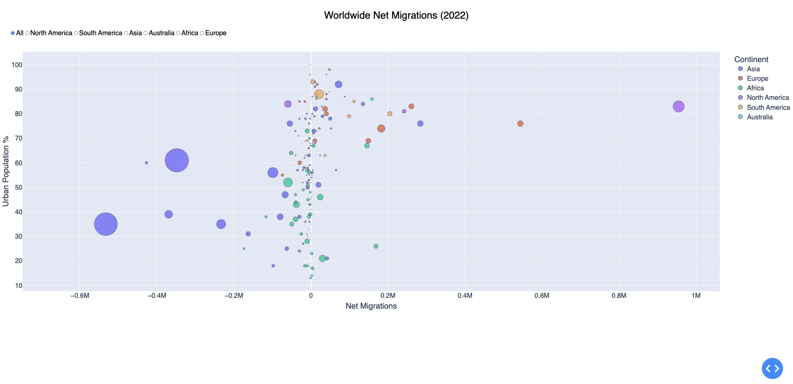
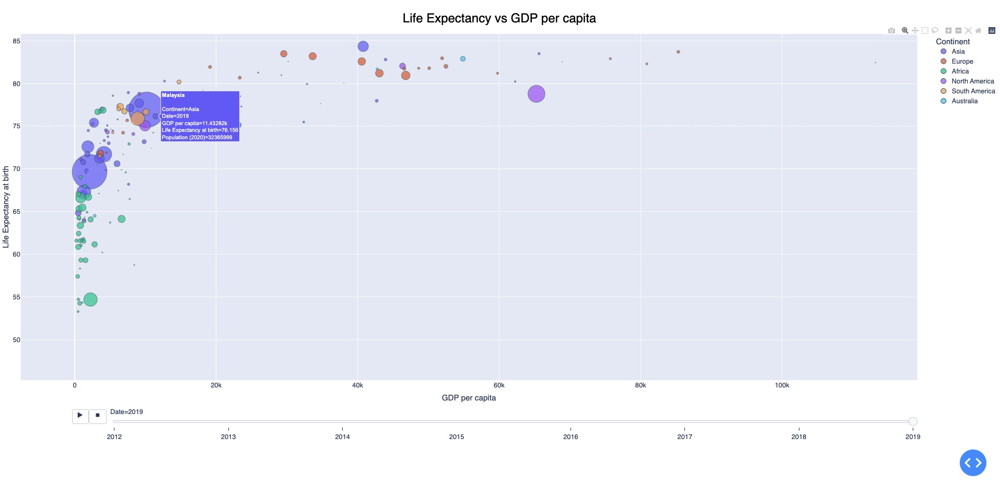

# PlotlyDash-WorldEconomicStandings
Beginning 2020, we have encountered highly volatile events that impacted countries across the globe – pandemic, supply chain disruptions, and impending war. This project aims to visualize qualitative and quantitative standings among countries worldwide, specifically in observing livelihood through happiness, life expectancy, GDP, and immigration statistics.

1. World Happiness Report

Visualization depicts survey results of the world happiness report. The visualization presents data through an interactive Robinson projected map (natural earth in plotly). Each country is highlighted in color to depict happiness adhering to the scale found on the right.



2. World Population (migrants)

Visualization is a bivariate scatterplot depicting country’s relationship of the net change in migrants and the percentage of the urban population. The plot points represent countries, and the size reflects population – larger sizes imply high population and vice versa for smaller point sizes. Hovering over a point prompts a tooltip to convey specifics details; country name, net migration change, urban population, and continent. For convenience, I added option boxes on the top left to allow the audience to filter countries by continent – the below image reflects selecting North America.



3. Life Expectancy vs GDP per capita

Visualization is of bivariate scatter plot depicting country's relationship of life expectancy to GDP per capita (average income per person) across 2012 to 2019. The plot points represent countries, and the size reflects population – larger sizes imply high population and vice versa for smaller point sizes. Hovering over a point prompts a tooltip to convey specifics details; country name, GDP per capita, life expectancy, population, and continent. The coloring of points reflects the country's location by continent as designated in legend. Underneath the visualization is a range scale to allow the audience to filter by time periods. Furthermore, selecting the play button will animate data over all time periods.



 ## Run Instructions ##

 1. Install Required Libraries
    ``` 
    pip install -r requirements.txt
    ```
2.  Execute command (Unix) to run dashboard
    ```
    python happiness/happiness.py
    python migrants/migrants.py
    python life-expectancy/life-expectancy.py
    ```
3.  Open webpage: http://127.0.0.1:8050/